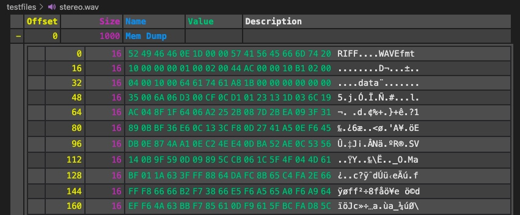
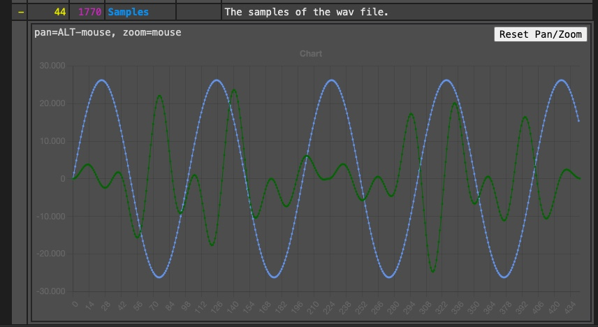
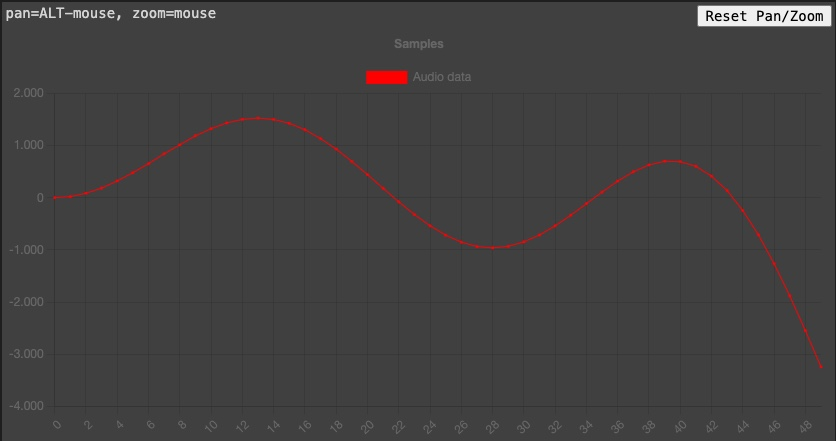
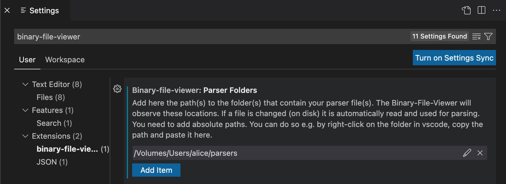
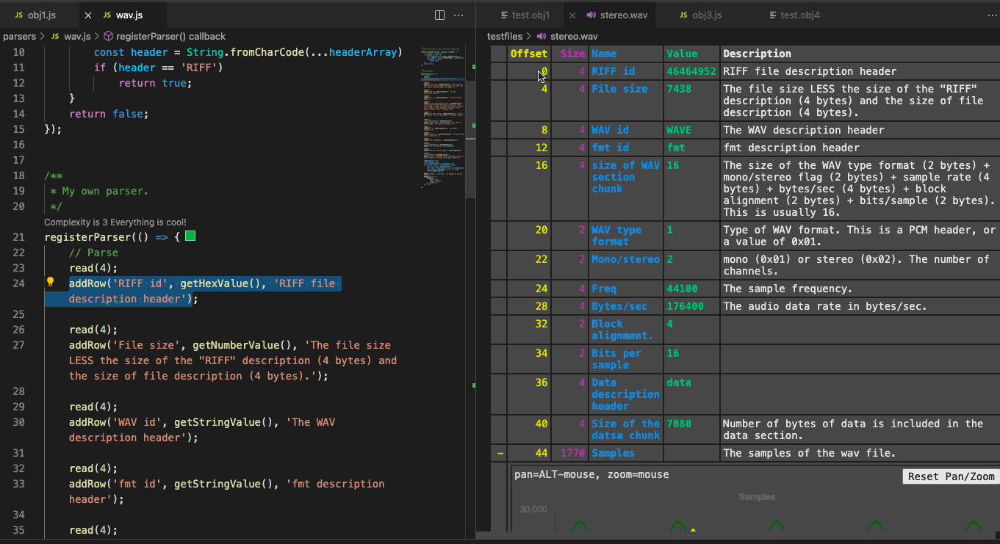
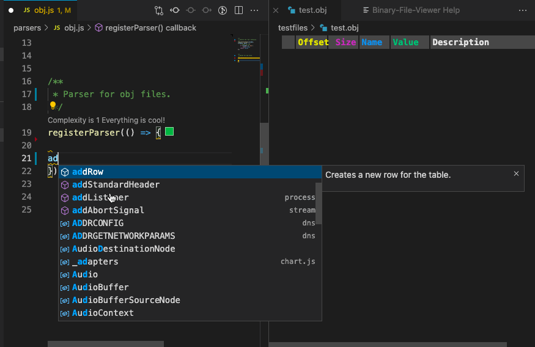
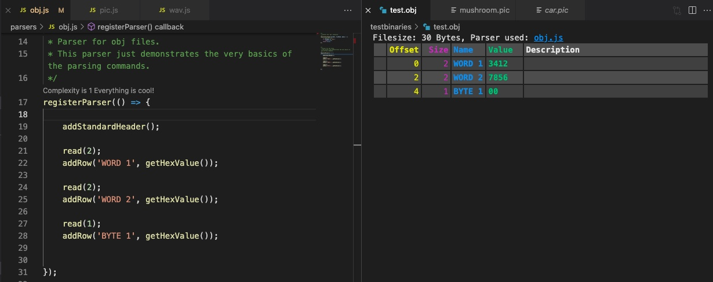
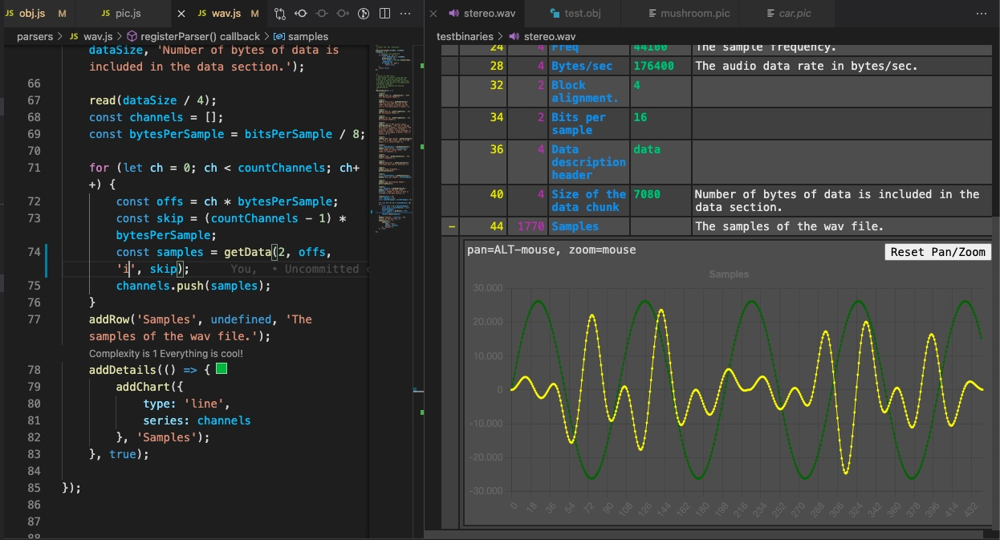
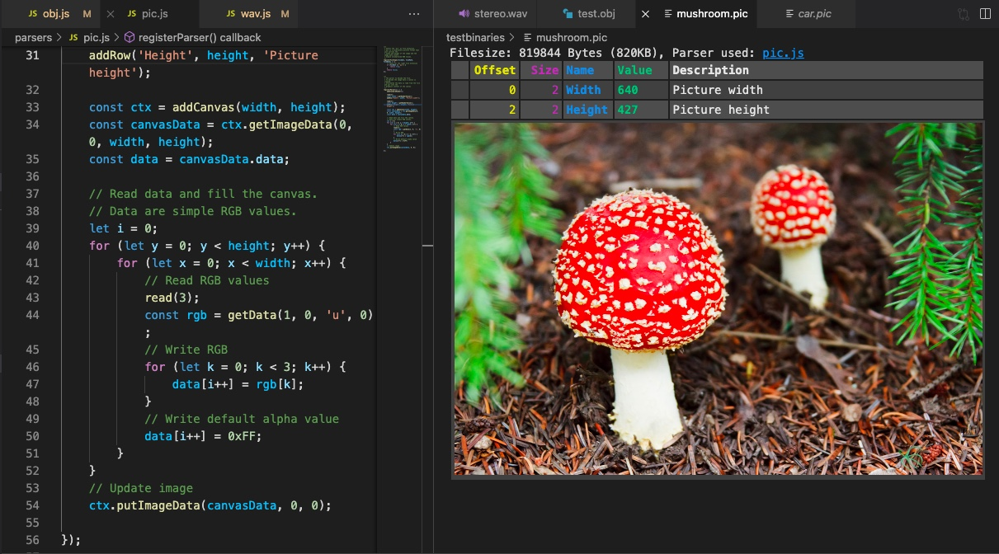

# The Binary File Viewer

You can use "CTRL-F" for searching this help.

## Support

If you like the "Binary File Viewer" please consider supporting it.

<a href="https://github.com/sponsors/maziac" title="Github sponsor">
	
</a>
&nbsp;&nbsp;
<a href="https://www.paypal.com/donate/?hosted_button_id=K6NNLZCTN3UV4&locale.x=en_DE&Z3JncnB0=" title="PayPal">
	
</a>


## Walkthrough

There exists also a basic walkthrough. You can open it from the command palette via: 'Get Started: Open Walkthrough...' -> 'Binary File Viewer'.


## Concept

The 'Binary File Viewer' is a framework that allows you to build your own custom viewers for binary files.
These files can be either existing file formats for which no vscode extension exists or also proprietary file formats.
I.e. file formats that you build on your own and for which you would like to have a convenient way to look inside.

To tell the 'Binary File Viewer' what files to decode and how, you have to provide a javascript file.
This *.js file consist of 2 stages. I.e. you basically register 2 functions:
- with 'registerFileType' you register the function which checks for the right file type. Normally you just check the file extension here.
- with 'registerParser' you register the function which actually decodes the binary file.


### registerFileType

The 'Binary File Viewer' itself registers inside vscode for every file type (\*.*).
I.e. whenever you select a file to be viewed the 'Binary File Viewer' will iterate through all of your js files until it finds one that returns true to indicate that it can decode the file.

Here is an example that registers for 'wav' files by checking the file extension:
~~~js
registerFileType((fileExt, filePath, fileData) => {
	// Check for wav extension
	if (fileExt == 'wav') {
		return true;
	}
	return false;
});
~~~

For more complicated checks other arguments are passed:
- fileExt: The file extension without the '.', e.g. 'wav'.
- filePath: The absolute file path to the binary file.
- fileData: You can access the file data through this object.

Although normally not required, ```fileData``` can be quite handy in some situations.
With ```fileData```you can access the file contents and check e.g. the header of a file for certain data. E.g. some files carry an ID at the start of the file to identify the file type.
A more enhanced version of the file type check for wav files could look like this:
~~~js
registerFileType((fileExt, filePath, fileData) => {
	// Check for wav extension
	if (fileExt == 'wav') {
		const headerArray = fileData.getBytesAt(0, 4);
		const header = String.fromCharCode(...headerArray)
		if (header == 'RIFF')
			return true;
	}
	return false;
});
~~~
This example checks for the string 'RIFF' at the beginning of the wav file. If not found it is not recognized as wav file.

Note: at this stage the file data is only read if you make use of ```fileData```. Otherwise, for performance reasons, the file data is not read.

On ```fileData``` two methods can be called:
- ```getBytesAt(offset: number, length = 1): number[]```
Returns the bytes from the file at the given offset.
	- ```offset```: The file offset.
	- ```length```: The number of bytes to return. Defaults to 1.
	- returns: A number array with the values. The length of the array might be smaller than 'length' if the file size is smaller.
- ```getFileSize(): number```
Returns the file size in bytes.


### registerParser

This is the main function you need to install.
Here you read in the data from the file and you create the output for the viewer's window.
Basically you add a row for each decoded value in a table.


The above output is achieved with the following 4 lines of code:
~~~js
registerParser(() => {
	read(4);
	addRow('RIFF id', getStringValue(), 'RIFF file description header');

	read(4);
	addRow('File size', getHexOxValue(), 'The file size LESS the size of the "RIFF" description (4 bytes) and the size of file description (4 bytes).');
}
~~~

The addRow parameters correspond exactly with the columns in the shown row.

```addRow(name: string, value?: string|number, description?: string)```
- ```name```: The name of the value.
- ```value```: (Optional) The value to display.
- ```description```: (Optional) A short description of the entry.

The first 2 columns are automatically filled by the 'Binary File viewer':
- Offset: Is the offset from the start of the file. (Or the offset from the start of ```addDetails```, see later.)
- Size: Is the size of the data object represented by the row.

An important aspect of the size is that it is no parameter to the ```addRow```.
In fact it is directly used from the previous ```read```.

Note: If you pass the string returned by getDecimalValue, getHex*Value or getBitsValue to ```addRow``` you can also hover over the 'Value' cell. For a decimal value the hover will show the hex value and vice versa.

### read

As you have seen before: with ```read``` you will read in data from the file.
The reading starts at the last position. I.e. for the first ```read``` at offset 0 or for the following ```read``` after the previous ```read```.

All of the ```get...``` functions work on the data of the previous ```read```.

This example reads in a single byte:
~~~js
	read(1);
	const val = getNumberValue();
~~~

Because the size was 1, ```getNumberValue```will return only 1 byte.

In the next example a word, i.e. a 2 byte number, is read:

~~~js
	read(2);
	const val = getNumberValue();
~~~

The ```get...``` functions do not change the file offset in any way.
I.e. in the following example:
~~~js
	read(2);
	const val1 = getNumberValue();
	const val2 = getNumberValue();
~~~

```val1``` and ```val2``` are the same values. They are read from the same file data offsets.


### readBits

Similar to ```read``` you can use ```readBits``` to read an amount of bits.
After usage of ```readBits``` the ```get...``` functions will operate on the bits instead of the bytes.

If bits are read the display of the size changes and displays an additional dot, e.g. ".5" for bit 5 or ".7-4" to indicate the bit range 7-4.

Note: If you read at least one bit of a byte, the next ```read``` will start on the next byte.

### Endianness

The default for reading data is little endian.
You can change it via ```setEndianness```.
Changing the endianness will take effect on the next ```get...``` function.
Please note that changing the endianness will not effect values read with ```readBits```, only values read with ```read```.


### addDetails

```addDetails```is used to make rows expandable.
I.e. when using ```addDetails``` the previous row gets a '+' sign:


If you click it with the mouse the row expands:


Here is the code for the above:
~~~js
	read(4);
	addRow('RIFF id', getStringValue(), 'RIFF file description header');

	addDetails(() => {
		read(1);
		addRow('1rst char', getNumberValue());
		read(1);
		addRow('2nd char', getNumberValue());
		read(1);
		addRow('3rd char', getNumberValue());
		read(1);
		addRow('4th char', getNumberValue());
	});
~~~

When you use ```addDetails``` the current file offset position and the read size is pushed on an internal stack and popped when the ```addDetails``` function finishes.

I.e. the next row can be decoded just like before with:
~~~js
	read(4);
	addRow('RIFF id', getStringValue(), 'RIFF file description header');

	addDetails(() => {
		read(1);
		addRow('1rst char', getNumberValue());
		read(1);
		addRow('2nd char', getNumberValue());
		read(1);
		addRow('3rd char', getNumberValue());
		read(1);
		addRow('4th char', getNumberValue());
	});

	read(4);
	addRow('File size', getNumberValue(), 'The file size LESS the size of the "RIFF" description (4 bytes) and the size of file description (4 bytes).');
~~~


The offset shown in an ```addDetails``` section is always the offset from the beginning of the ```addDetails``` section.

### addMemDump

If you just want to output a memory dump of a region you can use ```addMemDump```.
If you additionally put it into ```addDetails```you can make it expandable.

E.g.:
~~~js
	read(1000);
	addRow('Mem Dump');
	addDetails(() => {
		read(1000);
		addMemDump();
	});
~~~

results in:



Note: Hovering above the values will give additional information about the relative and absolute offset.


### readRowWithDetails

```readRowWithDetails``` combines ```addRow``` and ```addDetails```.
But it is not just a shortcut for both commands. Its behavior is slightly different.

Whenever the size of a group of data is known in advance, e.g. by a length field in the binary, ```addRow``` and ```addDetails``` are fine to use.
If ```addDetails``` is initially closed the parsing is delayed until the section is opened which is good for the performance.

But in some case the size is not known beforehand and requires decoding of the complete data group.
In these cases ```readRowWithDetails``` is the right choice. The 'details' are parsed in any case even if initially closed.
The name and offset field of the main row are set at the start of the call to this function but the size, the value and the description field are set at the end.
I.e. the size is automatically calculated by adding all of the ```read``` sizes inside the details.
And the value and description can be returned by the arrow function. I.e. you can use some of the values decoded inside the details to show up in the (summary) main row if you like.
You can also decide to return nothing. Then the value and description fields stay empty.

Example:
~~~js
	readRowWithDetails('Palette', () => {
		read(2);
		const count = getNumberValue();
		for(let i = 0; i < count; i++) {
			read(1);
			addRow('Red', getNumberValue());
			read(1);
			addRow('Green', getNumberValue());
			read(1);
			addRow('Blue', getNumberValue());
		}
		return {
			value: '' + count + ' Colors',
			description: 'The color palette.'
		};
});
~~~

Important: With ```addDetails``` the current read pointer is put on a stack and popped when the arrow function ends.
With ```readRowWithDetails``` this is different (therefore the name starts with 'read'): The (main) read pointer is incremented which each ```read```.


### addChart

To visualize data series you can use the ```addChart``` command.


In the basic form you just need to collect data in a number array that you can then use to display in a chart.

~~~js
	read(100);
	const samples = getData(2);
	addChart({
		series: [samples]
	}, 'Samples');
~~~

You can display more than one series by simply adding another number array to the series array. E.g.:
~~~js
	addChart({
		series: [
			samples1,
			samples2
		]
	}, 'Chart');
~~~




To get some more control you can also add an object with ```Series``` instead of a simple number array.

A ```Series``` is defined as
~~~js
interface Series {
	samples: number[],
	label?: string,
	color?: string
}
~~~

E.g.:
~~~js
	read(100);
	const sampleData = getData(2);
	const sampleSeries = {
		samples: sampleData,
		label: 'Audio data',
		color: 'red'
	};
	addChart({
		series: [sampleSeries]
	}, 'Samples');
~~~




### addCanvas

For visualizing r.g. of embedded pictures there exists a canvas object that you can draw to.
You create one with
~~~js
	const ctx = addCanvas(1000, 300, 'My Canvas');
~~~
Returned is a ```CanvasRenderingContext2D``` that you can use for drawing.

The example here creates a canvas object and draws a red rectangle inside:
~~~js
	const ctx = addCanvas(1000, 300, 'My Canvas');
	// Fill whole canvas with black
	const w = ctx.canvas.width;
	const h = ctx.canvas.height;
	ctx.fillStyle = 'black';
	ctx.fillRect(0, 0, w, h);
	// Draw a red rect
	ctx.fillStyle = 'red';
	ctx.fillRect(200, 100, 600, 150);
~~~


### Debugging

For debugging purposes there exist 2 commands.

Use
~~~
	dbgStop();
~~~

to stop the execution of the parser.

```dbgLog``` can be used to log texts and values.
E.g.
~~~
	dbgLog("Counter:", counter);
~~~

I.e. the use is similar to ```console.log``` but in contrast ```dbgLog``` is not able to print complex data like objects.

The output goes into the OUTPUT pane under "Binary File Viewer".

With ```dbgOverrideDetailsOpen``` you can control/override the open/close state of the following 'details' commands, i.e. ```addDetails``` and ```readRowWithDetails```.


## Parser Path

The path(s) to your parser file(s) can be changed in the settings:



## Navigation

If you have the parser (*.js) file open and then click on the offset value of the decoded binary file, the function that was used to create the row will become selected.




## Interactive Usage

If you open the parser file and the decoded binary file side-by-side you can easily extend your parser and watch the effect in the decoding immediately.

Just save your parser file to update the decoded file.



This does work only if both, the parser file and the decoded file, are open in the same vscode window.
If the parser file is opened in another vscode window or in a completely different editor and changed, the binary file view will not be updated automatically.

For these case you can press the 'Reload' button in the binary file view.


## Examples

In the github repository there exist a few example parser and binary files.
You'll find them [here](https://github.com/maziac/binary-file-viewer/tree/main/examples).

In order to use them you need to download the files and put the parser (*.js) files in your parser folder (the one you used in the settings).

You can also download the test binaries.
When opened in vscode you are able to decode them with the parser files.

### [obj.js](https://github.com/maziac/binary-file-viewer/tree/main/examples/parsers/obj.js)

A very basic parser. Just showing the simplest commands.




### [wav.js](https://github.com/maziac/binary-file-viewer/tree/main/examples/parsers/wav.js)

A parser to decode wav files.
It demonstrates the usage of charts.
It works with the wav files in the testbinaries folder.
It may or may not work with other wav files.



### [pic.js](https://github.com/maziac/binary-file-viewer/tree/main/examples/parsers/pic.js)

A parser which decodes a proprietary picture file format.
This file format was invented just to demonstrate how to use a canvas.




